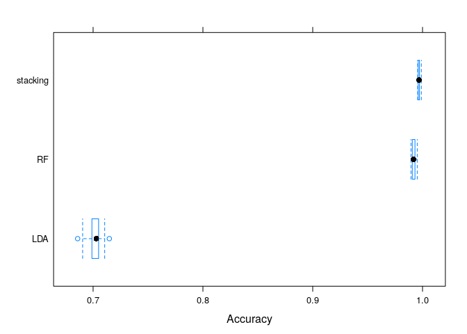

# Human Activity Recognition - A Quick Practical Machine Learning Approach

## 1. Background
-------------

### a. Sypnosis

Using devices such as *Jawbone Up*, *Nike FuelBand*, and *Fitbit* it is
now possible to collect a large amount of data about personal activity
relatively inexpensively. These type of devices are part of the
quantified self movement – a group of enthusiasts who take measurements
about themselves regularly to improve their health, to find patterns in
their behavior, or because they are tech geeks. One thing that people
regularly do is quantify how *much* of a particular activity they do,
but they rarely quantify *how well they do it*. In this project, your
goal will be to use data from accelerometers on the belt, forearm, arm,
and dumbell of 6 participants. They were asked to perform barbell lifts
correctly and incorrectly in 5 different ways. More information is
available from the website here:
<a href="http://groupware.les.inf.puc-rio.br/har" class="uri">http://groupware.les.inf.puc-rio.br/har</a>
(see the section on the Weight Lifting Exercise Dataset).

### b. Prediction goal

The goal is to predict the manner in which they did the exercise. This
is the “classe” variable in the training set.

This report covers how the model was built, what the expected
out-of-sample error is, and evaluates the prediction model.

## 2. Data
-------

### a. Training set and testing set

The training set is downloaded and stored as “pml-training.csv”. I load
the data and partition it into a training and test set.

    #Load the caret package
    library(caret)

    ## Loading required package: lattice

    ## Loading required package: ggplot2

    #Download and read and store the csv data used for training to train_dat
    download.file("https://d396qusza40orc.cloudfront.net/predmachlearn/pml-training.csv",
                  destfile = "pml-training.csv",
                  method = "curl")
    train_dat <- read.csv("pml-training.csv", 
                          na.strings = c("NA","#DIV/0!", ""))
    train_dat$classe <- as.factor(train_dat$classe) #coerce into factor

    #Remove the first 7 columns of the data since they are the personal information and clearly of no use for the prediction. Also remove "Near Zero variables" and columns with more than 60% of missing data
    train_dat <- train_dat[,-c(1:7)]
    train_dat <- train_dat[,-nearZeroVar(train_dat)]
    tempData <- colSums(is.na(train_dat)) <= 0.6*nrow(train_dat)
    train_dat <- train_dat[, tempData]

    #Create data partitions: train and test for training and testing data, with 75% and 25% of the data points respectively.
    trainIndex <- createDataPartition(train_dat$classe,
                                      p=0.75, list = FALSE)
    train <- train_dat[trainIndex,]
    test <- train_dat[-trainIndex,]

### b. Evaluation set

The evaluation set contains of 20 different test cases.The final model
will be evaluate using this evaluation set.

    #Download and load evaluation data
    download.file("https://d396qusza40orc.cloudfront.net/predmachlearn/pml-testing.csv",
                  destfile = "pml-testing.csv",
                  method = "curl")
    eva <- read.csv("pml-testing.csv",
                    na.strings = c("NA","#DIV/0!", ""))[,-c(1:7)]

## 3. Prediction algorithm
-----------------------

### a. Prediction approach

My approach to predict “classe” from the Human Activity Recognition
dataset is rather simple and naive. I will choose a model from the
linear model family and a tree-based algorithm, estimate their expected
out-of-sample error using cross-validation and blend (stacking) them. I
will use Linear Discriminant Analysis (LDA) and Random Forest. I will
stack them using Support Vector Machine (SVM).

### b. Fitting models and prediction algorithms

#### Model 1: Linear discriminant analysis (LDA)

    #Fit Linear Discriminant Analysis
    model_lda <- train(classe ~ ., method = "lda", data = train)
    model_lda

    ## Linear Discriminant Analysis 
    ## 
    ## 14718 samples
    ##    52 predictor
    ##     5 classes: 'A', 'B', 'C', 'D', 'E' 
    ## 
    ## No pre-processing
    ## Resampling: Bootstrapped (25 reps) 
    ## Summary of sample sizes: 14718, 14718, 14718, 14718, 14718, 14718, ... 
    ## Resampling results:
    ## 
    ##   Accuracy   Kappa    
    ##   0.6976013  0.6174376

The accuracy of LDA model is .

#### Model 2: Random Forest

    #Fit Random Forest with total 400 trees grown and 7 variables each split with parallel computing
    library(doParallel)

    ## Loading required package: foreach

    ## Loading required package: iterators

    ## Loading required package: parallel

    cl = makeCluster(4)
    registerDoParallel(cl)

    model_rf <- train(classe ~ ., method = "rf", ntree=128,
                      tuneGrid=data.frame(.mtry = 7),
                      data = train, allowParallel = TRUE)
    stopCluster(cl)
    remove(cl)
    registerDoSEQ()
    model_rf

    ## Random Forest 
    ## 
    ## 14718 samples
    ##    52 predictor
    ##     5 classes: 'A', 'B', 'C', 'D', 'E' 
    ## 
    ## No pre-processing
    ## Resampling: Bootstrapped (25 reps) 
    ## Summary of sample sizes: 14718, 14718, 14718, 14718, 14718, 14718, ... 
    ## Resampling results:
    ## 
    ##   Accuracy   Kappa    
    ##   0.9919161  0.9897727
    ## 
    ## Tuning parameter 'mtry' was held constant at a value of 7

The accuracy of Random Forest model is .

#### Model stacking

Now we can prepare and compare the accuracy of predicted classes
produced from 2 models.

    #Prediction from LDA
    pred_lda <- predict(model_lda, newdata = test)

    #Prediction from Random Forest
    pred_rf <- predict(model_rf, newdata = test)

    #Data frame contains the actual classe value in testing set and 2 prediction values from 2 models
    meta <- data.frame(classe_sb = test$classe,
                       lda = pred_lda, 
                       rf = pred_rf)

Now I compared the accuracy of 2 models to the test data.

    confusionMatrix(pred_lda, test$classe)

    ## Confusion Matrix and Statistics
    ## 
    ##           Reference
    ## Prediction    A    B    C    D    E
    ##          A 1163  133   84   42   34
    ##          B   24  624  108   30  147
    ##          C  104  107  532   96   74
    ##          D   95   44  107  599   87
    ##          E    9   41   24   37  559
    ## 
    ## Overall Statistics
    ##                                           
    ##                Accuracy : 0.709           
    ##                  95% CI : (0.6961, 0.7217)
    ##     No Information Rate : 0.2845          
    ##     P-Value [Acc > NIR] : < 2.2e-16       
    ##                                           
    ##                   Kappa : 0.6317          
    ##                                           
    ##  Mcnemar's Test P-Value : < 2.2e-16       
    ## 
    ## Statistics by Class:
    ## 
    ##                      Class: A Class: B Class: C Class: D Class: E
    ## Sensitivity            0.8337   0.6575   0.6222   0.7450   0.6204
    ## Specificity            0.9165   0.9219   0.9059   0.9188   0.9723
    ## Pos Pred Value         0.7988   0.6688   0.5827   0.6427   0.8343
    ## Neg Pred Value         0.9327   0.9182   0.9191   0.9484   0.9192
    ## Prevalence             0.2845   0.1935   0.1743   0.1639   0.1837
    ## Detection Rate         0.2372   0.1272   0.1085   0.1221   0.1140
    ## Detection Prevalence   0.2969   0.1903   0.1862   0.1900   0.1366
    ## Balanced Accuracy      0.8751   0.7897   0.7641   0.8319   0.7963

    confusionMatrix(pred_rf, test$classe)

    ## Confusion Matrix and Statistics
    ## 
    ##           Reference
    ## Prediction    A    B    C    D    E
    ##          A 1395    2    0    0    0
    ##          B    0  943    5    0    0
    ##          C    0    4  848    7    0
    ##          D    0    0    2  797    2
    ##          E    0    0    0    0  899
    ## 
    ## Overall Statistics
    ##                                           
    ##                Accuracy : 0.9955          
    ##                  95% CI : (0.9932, 0.9972)
    ##     No Information Rate : 0.2845          
    ##     P-Value [Acc > NIR] : < 2.2e-16       
    ##                                           
    ##                   Kappa : 0.9943          
    ##                                           
    ##  Mcnemar's Test P-Value : NA              
    ## 
    ## Statistics by Class:
    ## 
    ##                      Class: A Class: B Class: C Class: D Class: E
    ## Sensitivity            1.0000   0.9937   0.9918   0.9913   0.9978
    ## Specificity            0.9994   0.9987   0.9973   0.9990   1.0000
    ## Pos Pred Value         0.9986   0.9947   0.9872   0.9950   1.0000
    ## Neg Pred Value         1.0000   0.9985   0.9983   0.9983   0.9995
    ## Prevalence             0.2845   0.1935   0.1743   0.1639   0.1837
    ## Detection Rate         0.2845   0.1923   0.1729   0.1625   0.1833
    ## Detection Prevalence   0.2849   0.1933   0.1752   0.1633   0.1833
    ## Balanced Accuracy      0.9997   0.9962   0.9945   0.9952   0.9989

From the plot above, the LDA model seems to classify not so good
compared to the Random Forest model.

To stack 2 models for even better prediction, I combine 2 models using
Support Vector Machine (SVM). This is “meta-learning” actually.

    #Create prediction from 2 models using SVM
    model_svm <- train(classe_sb ~ ., data = meta, method = "svmLinear")
    pred_svm <- predict(model_svm, data = meta)

    #Result
    confusionMatrix(pred_svm, test$classe)

    ## Confusion Matrix and Statistics
    ## 
    ##           Reference
    ## Prediction    A    B    C    D    E
    ##          A 1395    2    0    0    0
    ##          B    0  943    5    0    0
    ##          C    0    4  848    7    0
    ##          D    0    0    2  797    2
    ##          E    0    0    0    0  899
    ## 
    ## Overall Statistics
    ##                                           
    ##                Accuracy : 0.9955          
    ##                  95% CI : (0.9932, 0.9972)
    ##     No Information Rate : 0.2845          
    ##     P-Value [Acc > NIR] : < 2.2e-16       
    ##                                           
    ##                   Kappa : 0.9943          
    ##                                           
    ##  Mcnemar's Test P-Value : NA              
    ## 
    ## Statistics by Class:
    ## 
    ##                      Class: A Class: B Class: C Class: D Class: E
    ## Sensitivity            1.0000   0.9937   0.9918   0.9913   0.9978
    ## Specificity            0.9994   0.9987   0.9973   0.9990   1.0000
    ## Pos Pred Value         0.9986   0.9947   0.9872   0.9950   1.0000
    ## Neg Pred Value         1.0000   0.9985   0.9983   0.9983   0.9995
    ## Prevalence             0.2845   0.1935   0.1743   0.1639   0.1837
    ## Detection Rate         0.2845   0.1923   0.1729   0.1625   0.1833
    ## Detection Prevalence   0.2849   0.1933   0.1752   0.1633   0.1833
    ## Balanced Accuracy      0.9997   0.9962   0.9945   0.9952   0.9989

    #Compare models
    compare <- resamples(list(LDA=model_lda, RF=model_rf, stacking=model_svm))
    bwplot(compare, metric = "Accuracy")

## 4. Submission

In the evaluation set, I will apply 2 models of LDA and Random Forest
and stack them using SVM model.

I will make prediction for 20 cases using model 1 (LDA), model 2 (Random
Forest) and final model (stacking model using SVM to blend LDA and
Random Forest)

    #Prediction from 2 models
    eva_mod_lda <- predict(model_lda, eva)
    eva_mod_rf <- predict(model_rf, eva)

    #Model stacking
    stacking <- data.frame(lda = eva_mod_lda,
                           rf = eva_mod_rf)
    pred <- predict(model_svm, newdata = stacking)
    data.frame(eva_mod_lda, eva_mod_rf, pred)

    ##    eva_mod_lda eva_mod_rf pred
    ## 1            B          B    B
    ## 2            A          A    A
    ## 3            B          B    B
    ## 4            C          A    A
    ## 5            C          A    A
    ## 6            C          E    E
    ## 7            D          D    D
    ## 8            D          B    B
    ## 9            A          A    A
    ## 10           A          A    A
    ## 11           D          B    B
    ## 12           A          C    C
    ## 13           B          B    B
    ## 14           A          A    A
    ## 15           E          E    E
    ## 16           A          E    E
    ## 17           A          A    A
    ## 18           B          B    B
    ## 19           B          B    B
    ## 20           B          B    B

The prediction using the final stacking model gives the same result with
the prediction from the Random Forest model.
